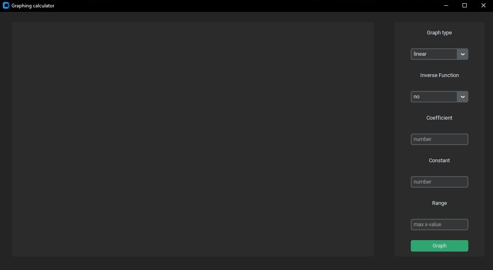
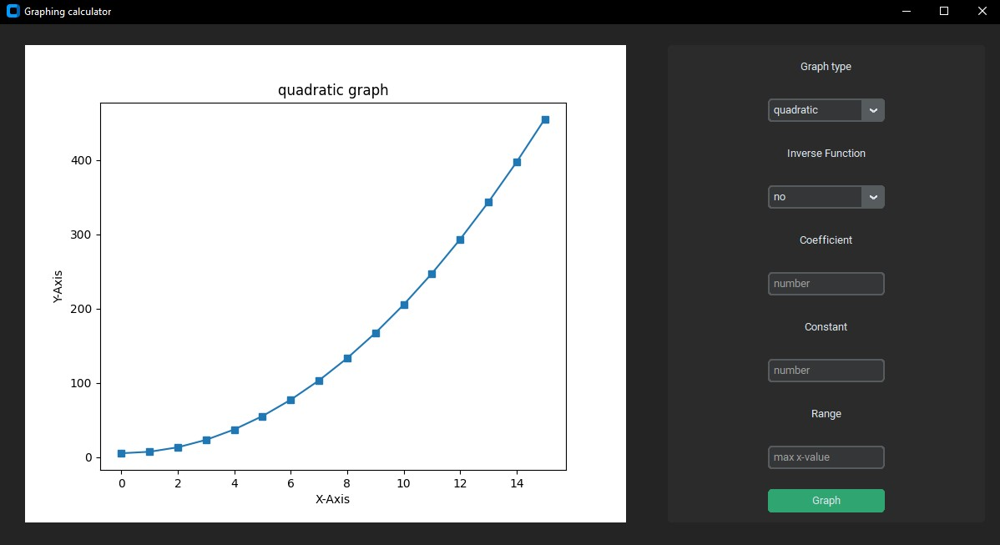

# Graphing_Calculator-py
A simple graphing calculator with a graphical user interface

## Table of Contents

1. [Getting started](#Getting-started)
2. [Usage](#Usage)
3. [Calculation](#calculation)


## <a id="Getting-started">Getting started</a>

The project runs on python and use matplotlib and customtkinter for data visualization

### Cloning

**Clone** the project files to your local repository:

- HTTPS => `https://github.com/edd-ie/Graphing_Calculator-py.git`
- SSH => `git@github.com:edd-ie/Graphing_Calculator-py.git`
- Git CLI => `gh repo clone edd-ie/Graphing_Calculator-py`

Open the directory/folder in terminal and install all dependencies using.

```
pip install -r requirements.txt
```

After installation run this command to start the app

```
python GraphUI.py
```

The app will be launched.

## <a id="Usage">Usage</a>

Data entry
1. Select type of graph
2. Select if you want the graph as an inverse function
3. Proved the coefficient of the function
4. Proved the constant of the function
5. Proved the max number to be ploted on x-axis
6. Click graph

The graph will be plotted on the blank side


## <a id="calculation">Calculation</a>
Data is represented as a variation of the function:
```text
    y = mx+c
```

Plot function take parameters to fill in the function
and empty array are generated for data storage
```python
def plot(fx, inv="no", coefficient=1, constant=0, range_x=1):
    x = []
    y = []
```

A loop with each value in the given range generates data for the y
while current value is appended to the x

A conditional statement decides which function is to be used to get 
the y value
```python
for i in range(range_x + 1):
    x.append(i)
    match fx:
        case "linear":
            y.append(coefficient * i + constant)
        case "quadratic":
            y.append(coefficient * (i ** 2) + constant)
        case "cubic":
            y.append(coefficient * (i ** 3) + constant)
        case _:
            y.append(coefficient * (i ** 2) + constant)
```

Finally, if the user wanted an inverse the values of x and y are switch
and the program outputs the data
```python
if inv == "yes":
    switch = y
    y = x
    x = switch

return [x, y]
```

The data is then used to plot the graph of the function